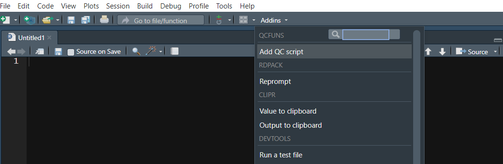

```{r, include = FALSE}
knitr::opts_chunk$set(
  collapse = TRUE,
  comment = "#>"
)
```

## Add QC script template to code snippet

You can add QC script template to your code snippet by running the following code. 
Then follow the prompt in console to proceed
```{r eval=FALSE}
add_snippets()
```

Or you can do the same by clicking the `Add QC script` in Addins.
```{r out.width="80%", echo = FALSE}

```

The QC script template looks like this:
```{r eval=FALSE}
### Header ###################################################################
# Original Reporting Effort:  ${1:Reporting effort}
# Program Name             :  ${2:Program name}
# R Version                :  `r R.Version()$version.string`
# Short Description        :  ${3:Description}
# Author                   :  ${4:Author}
# Date                     :  `r Sys.Date()`
# input                    :
# Output                   :  
# Remarks                  :

### Modification History #####################################################
#Rev       Modified By         Reporting Effort         Date      Description

### Prepping environment #####################################################
library(haven)
library(dplyr)
library(tidyr)
library(stringr)
library(QCfuns)

files.sources <- list.files(path = read_path(rptdrv, "qc"), 
                            pattern = "^qcf.*\\\.r", full.names = T)
sapply(files.sources, source)

### Derive QC dataset ########################################################

adsl <- read_sas(read_path(a_in, "adsl.sas7bdat")) %>% 
  mutate(across(where(is.character), zap_empty))
  
### Generate QC table ########################################################

first_row <- qc_cntrow1(adsl, "TRT01P", row_text = "Analysis set: Safety")

tab1 <- qc_cat_row(adsl, "TRT01P", rowvar = "SEX")

tab_qc <- bind_rows(first_row\$row1, tab1) %>% 
  mutate(across(everything(), ~replace(., is.na(.), "")))

### Read in RTF ##############################################################

tableid <- "${5:tableid}"
tab_rtf <- qc_rtf2df(tableid, path = opath[["PREPROD"]])

### Compare two datasets #####################################################

qc_comparedf(qc = tab_qc, rtf = tab_rtf, path = qc[["PDEV"]], 
             filename = tableid)
```

## Construct data frame using data to table functions
All data to table functions are listed below. For detailed description and example, please go to each function's help page.

Function Name           | Description
:---------------------- | :-------------------------------------------------------
`qc_cntrow1`            | Create Analysis Set Row 
`qc_cntrow1_chg`        | Create Analysis Set Row for Change From Baseline Table
`qc_cntrow1_shift`      | Create Analysis Set Row for Shift Table
`qc_cat_row`            | Create Rows for Categorical Variables
`qc_num_row`            | Create Rows for Continuous Variables
`qc_demo`               | Create Demographic Rows
`qc_cntpct`             | Create Count and Percentage Row
`qc_cntpct_byrowvar`    | Create Count and Percentage Table by Row Variables
`qc_chgfb`              | Create Change From Baseline Over Time Table
`qc_shift`              | Create Shift Table

The QCfuns package’s data to table functions distinguishes itself from other table creation packages, such as tidytlg and rtable, by taking a unique approach. Rather than attempting to create highly adaptable functions capable of producing all types of tables, QCfuns employs a single, standardized table output function. For example, the qc_demo function streamlines the creation of a common demographic table by incorporating all necessary steps. By inputting the ADSL dataset and a variable list, a single call to qc_demo generates the desired table output. This approach utilizes wrapper functions to expedite the validation check in the second step of the typical validation workflow. Since each study requires a demographic table or summary of AE tables, a uniform table layout is shared across studies. However, this approach has its limitations, and customized methods are required for study-specific tables. To meet these specific requirements, the QCfuns package also includes more versatile functions like qc_cat_row and qc_num_row.