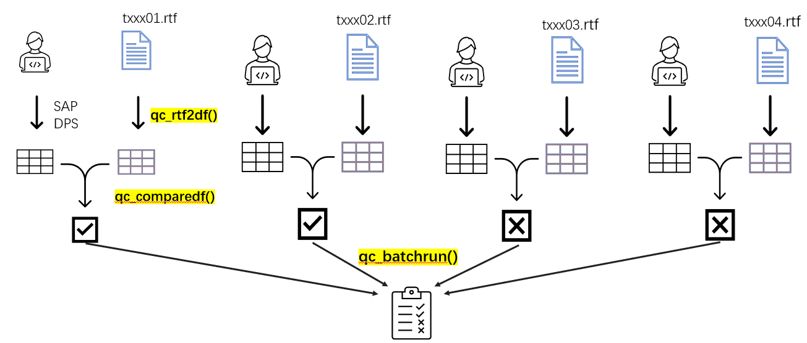
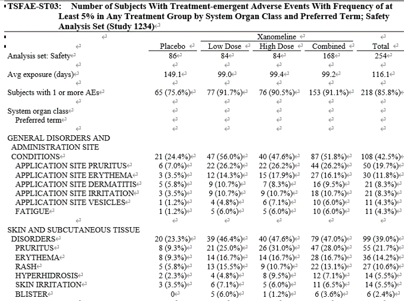
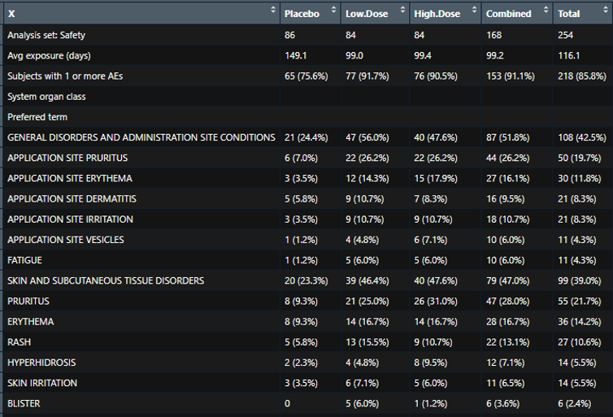
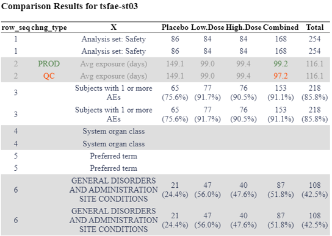
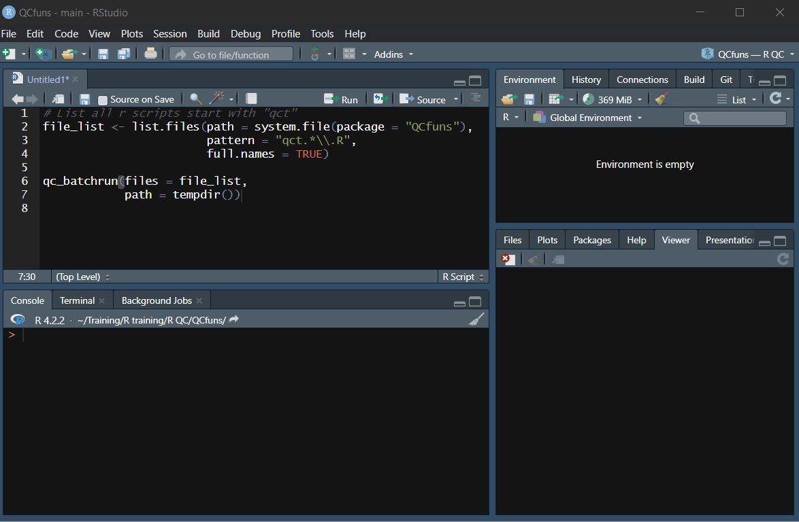
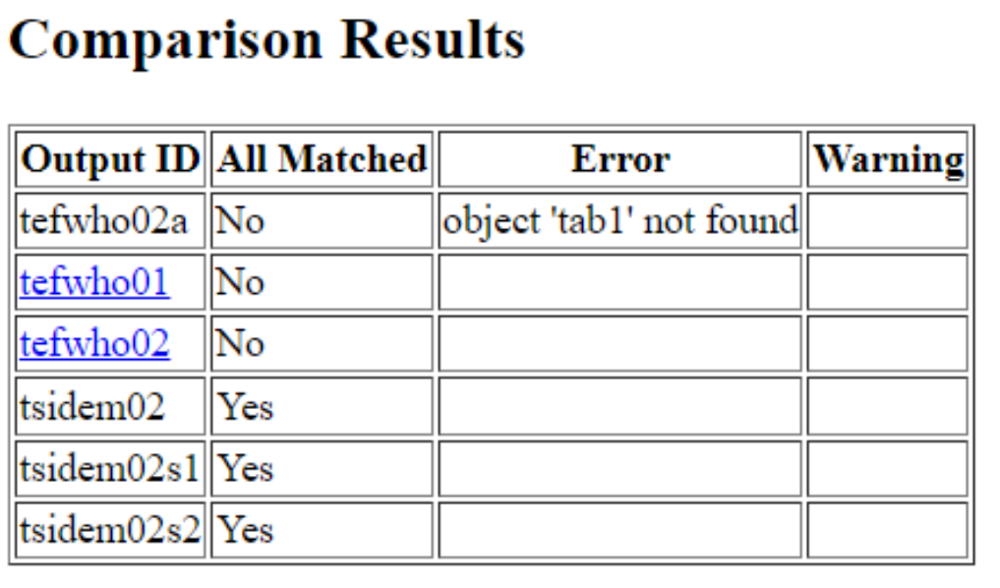

```{r setup, include=FALSE}
knitr::opts_chunk$set(
  collapse = TRUE,
  comment = "#>"
)
```

## Introduction
QCfuns package is a collection of R functions aiming to facilitate outputs validation
process. The functions can interact with each other and all together construct
a workflow that is efficient and easy to follow.

There are two types of functions in the workflow:

* Data to table functions. These functions take a dataframe of ADaM structure
as input and output a table-like dataframe. The names of these functions always
start with "qc_" and end with the type of table they are creating, 
such as `qc_demo`, `qc_shift`.

* Utility functions. Utility functions are functions that perform tasks
other than creating table-like dataframe from ADaM dataset. These functions
include `add_snippets`, `qc_rtf2df`, `qc_comparedf` and `qc_batchrun`.

## QC Workflow
The accuracy and integrity of clinical reports are essential for ensuring the safety and efficacy of investigational drugs. To validate the accuracy of clinical reports, double programming is often required. To streamline the QC programming workflow and optimize the productive review process, the QCfuns package offers a collection of handy R utility functions. The major features of this utility tool include the following.

-	Access build-in QC script template in snippet, which provides a helpful starting point than building scripts from scratch. 

-	Convert RTF table format into a data frame, which will be easily used to compare numbers between production and QC sides. RTFs can be either in SAS or in R.

-	Generate comparison results by comparing two data frames from QC work and production sides.

-	Perform batch run against all QC scripts and generate overall summary report for review.     

```{r out.width="100%", echo = FALSE}

```

As a QC programmer, our workflow begins by creating a dataframe based on ADaM datasets, SAP, and DPS. We then utilize the `qc_rtf2df` function in R to convert the table output from rtf format into a data frame. This allows us to easily manipulate and analyze the data.

Next, we employ the `qc_comparedf` function to compare the two dataframes. This function helps us identify any discrepancies or differences between the two datasets, allowing us to ensure the accuracy and consistency of our results.

In situations where we need to validate multiple outputs, we can repeat the validation process and streamline it using the `qc_batchrun` function. This function enables us to run all the QC scripts in one go and obtain a comprehensive summary report of the validation results.

## Key functions
To summarize, the key functions in our QC workflow are `qc_rtf2df`, `qc_comparedf` and `qc_batchrun`. Each function plays a crucial role in facilitating data conversion, comparison, and validation. The detailed introduction of these functions are as below.

### Read in rtf files

```{r eval=FALSE}
qc_rtf2df(filename = "tsfae-st03", path = opath[["PREPROD"]])
```

rtf layout

```{r out.width="80%", echo = FALSE}

```

R dataframe (Get rid of title, footnotes and empty lines)

```{r out.width="80%", echo = FALSE}

```

### Compare dataframes
qc_comparedf function leverages the compare_df function from the compareDF package to generate a concise and color-coded summary of comparison results between the data frame created and the data frame extracted from the rtf file

```{r eval=FALSE}
qc_comparedf(qc = tab_qc, rtf = tab_rtf, path = qc[["PDEV"]], filename = "tsfae-st03", keep_unchanged_rows = TRUE)
```

```{r out.width="70%", echo = FALSE}

```

### Batchrun
qc_batchrun function can digest the results from qc_comparedf and produce a comprehensive summary of the validation status for multiple outputs simultaneously with log and comparison output for each individual script. The qc_batchrun can be executable not only in RStudio interactively, but also allow users to run batch jobs independently of the RStudio IDE.

```{r eval=FALSE}
### select all r scripts start with 'qct' on SPACE
qc_files <- list.files(path = qc[["PDEV"]], pattern = "qct.*\\.r", 
                       full.names = TRUE)

qc_batchrun(files = qc_files, path = qc[["PDEV"]])
```

```{r out.width="100%", echo = FALSE}

```

Scripts with errors and mismatched results will be on the top of the summary report. Individual comparing results can be accessed by hyperlinks

```{r out.width="60%", echo = FALSE}

```
